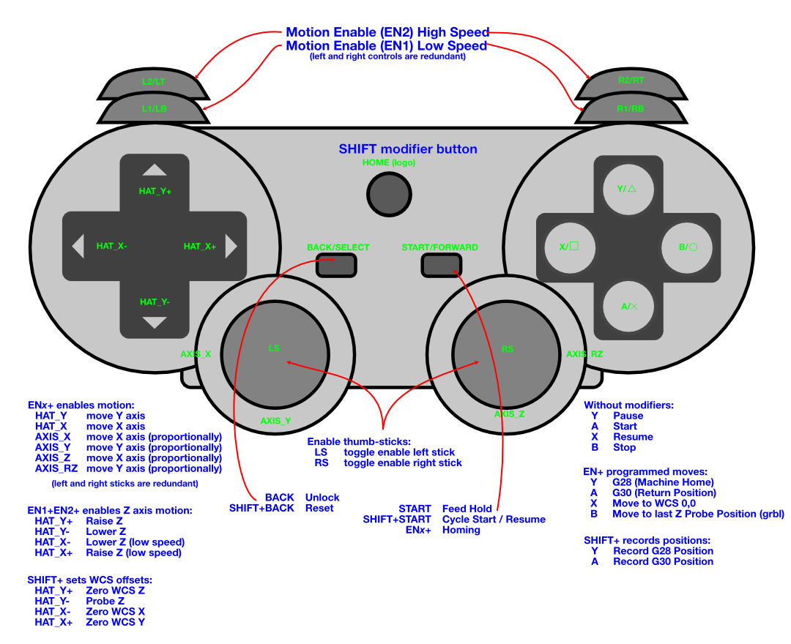

Generic Gamepad Support for CNC.js
==================================

 [1]: https://cnc.js.org
 [2]: https://github.com/cncjs/cncjs-pendant-ps3
 [3]: https://github.com/cmidgley/cncjs-pendant-ps3
 [4]: https://github.com/balthisar/cncjs-pendant-gamepad
 [5]: http

Provides support for the use of a generic gamepad as a wireless/Bluetooth or USB pendant for [CNC.js][1], allowing for operations like jogging, homing and managing jobs.

Controller Support
------------------

**Currently, only grbl is officially supported. _Please help_.** It’s highly likely that Marlin works (it looks okay, but I only use Marlin with a printer, so I can’t test it), but I have no idea how to implement/test Smoothieware and TinyG controllers. Please feel free to fork and tweak and submit a PR, or send me a controller. Confirmation that Marlin is good to go would be appreciated, too.

Fork Information
----------------

This is a continuing fork of the original [cncjs-pendant-ps3 by Austin St. Aubin][2] and [the updated but unfinished fork by Chris Midgley][3], and is currently maintained [here][4].

This and previous forks intend to add the following features:

- Works with any gamepad.

    - Don’t have a supported gamepad? Consider adding one - it’s easy! Look
      at `src/gamepad_controller.ts` for an example.
      
- Abstracted gcode to allow for support of different controllers and machines

    - Currently supports Grbl and Marlin
    
    - Don’t have the controller you need?  Consider adding one - it’s easy!
      Look at `src/gcode-marlin.ts` for an example.
      
- Added debugging features (see `--fake-socket` and `--verbose`).

- Auto-reconnect to pendant if connection fails.

- Made `--port (-p)`, `--baudrate (-b)` and `--controller-type (-t)` required 
  parameters 

- Added computed feed speed based on distance to travel to have gantry that
  quickly respond to changes (required at least for Marlin)

- Specify the z-probe touch plate thickness on the command line, if needed.

Note also that this fork is in mid-transition to conversion to TypeScript. It’s
not complete, and real programming discipline will be added incrementally.

Button Map
----------

Button mapping is as shown below. It’s significantly different than the default button mapping used in the original PS3 version of this pendant. It reflects how I use my machine, and it’s fairly easy to make changes to suit your own tastes in any case.

Gamepad Setup
-------------

You should ensure that your operating system is already setup to recognize and use the gamepad of your choice. Consult the internet if you need help in this regard.

### Quick Connection Test 

You can quickly test connectivity to your gamepad by performing:

    ls /dev/input

If this works, you should see something like this (most importantly, the `js0`):

    $ ls /dev/input
    event0  event1  event2  js0  mice  mouse0

If the gamepad is not connected, you might see:

    $ ls /dev/input
    event0  mice  mouse0

### Test using the joystick application

    # Install
    sudo apt-get -y install joystick

    # Usage / Test
    jstest /dev/input/js0

You will see a live output of the various switches and joysticks, and can test the operation of the joystick.  Break out with `Ctrl-C` when done.

Installation
------------

Maybe I’ll add this to NPM when some type of stability is achieved, but for now, I recommend running locally so that you can tweak things.

Just like CNCjs, this pendant is a Node.js script, so it’s likely you already have a working Node.js installation. This pendant is developed with Node.js 16, which is the newest LTS version as of this writing. Note that CNCjs works quite well on this version of Node.js.

    git clone https://github.com/balthisar/cncjs-pendant-gamepad.git && cd cncjs-pendant-gamepad
    npm install

Running this way, the main script won’t be in your path, so you can start it directly from the `bin/` directory:

    bin/cncjs-pendant-gamepad.js -p /dev/ttyUSB0 -b 115200 -t grbl -vv run 

Running cncjs-pendant-gamepad
-----------------------------

The program accepts several optional arguments. Too see all options run:

    cncjs-pendant-gamepad.js --help

The most important options are `--port (-p)` to specify the communications port to the controller, `--baudrate (-b)` to specify the connection speed, and `--controller-type (-t)` to specify the type of controller you are running (Marlin, Grbl, etc).

Here is how those options are used. If CNC.js is already connected, the port is used to locate the existing connection and no reconnection or change is made to baudrate or controller.  However, if CNC.js is not connected, then these parameters are used to establish a connection to the controller.

To start the pendant server, run a command similar to this:

    cncjs-pendant-gamepad.js -p /dev/ttyUSB0 -b 115200 -t grbl run

First use recommendation
------------------------

I recommend running `cncjs-pendant-gamepad` using the `simulate` command, as you can see the commands being sent (such as gcode or operations such as stop) without moving the actual gantry.  This is very useful to prove that everything is working and helps as a teaching aid while getting used to using the controls.

Configuring for auto-start
--------------------------

Assuming you’ve got CNCjs set to autostart according to its own instructions, the simplest way to autostart this pendant is do use PM2, too:

    pm2 start --name pendant $(which node) -- $(which cncjs-pendant-gamepad) -p /dev/ttyUSB0 -b 115200 -t grbl -vvv
    pm2 save

Tweaking/Customizing
--------------------

### Building

This pendant is written using TypeScript, which is a Javascript superset. The source code in `src/` can be compiled into plain Javascript by:

    tsc

If nothing seems to happen, delete the `tsconfig.tsbuildinfo` file, which holds incremental build information.

### Code Overview

Tweaking should be relatively straight forward. The code is liberally commented, and interesting constants are at the top of files.

- `cncjs-pendant-gamepad.js` (in the `/bin` directory) simply calls `console`.

- `console` handles the command line interface and creates the rest of the program.

- `gamepad_controller` receives input from a game controller and creates events based on them.

- `actions` receives events from the controller, and contains the logic for making requests of the gcode sender.

- `gcode-sender` is the base class for controller-specific gcode senders. It contains methods that control CNCjs and/or your controller.

### Adding game controllers

You can run in `simulate` mode with lots of verbosity (`-vvv`) to have a look at keycodes for your particular controller. Then you can add it to the `controllerMapping` structure in the `gamepad_controller.ts` file.

### Adding CNC controllers

You should subsclass from the `GcodeSender` class and override the default implementation of methods that aren’t suitable for your own machine.

You should also update the CLI in `console` so that you can select the new machine.

Finally, in `actions` you can see how `GcodeGrbl` and `GcodeMarlin` are included and instantiated, and do the same for your new class.

Supporting Smoothieware and TinyG should be priorities, and any changes to Marlin that are needed would be appreciated,.
