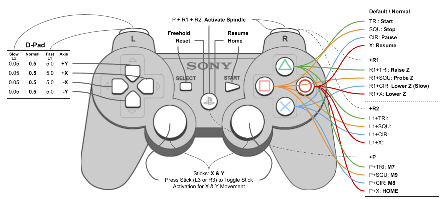

# cncjs-pendant-ps3
Dual Shock / PS3 Bluetooth Remote Pendant for CNCjs

Use [Playstation 3 Controller](https://www.playstation.com/en-us/explore/accessories/dualshock-3-ps3/) (wired using USB or wirelessly over bluetooth) to control CNCJS from the host device (raspberry pi).

[Remote Pendant (Playstation 3 Dualshock Controller / SIXAXIS Controller)](https://github.com/cheton/cnc/issues/103)

Using a wireless game controller (like a PS3 controller) seems to be one of the lowest cost & simplest solution method. See related issue [#103](https://github.com/cheton/cnc/issues/103)

## cmidgley fork information

This fork has been made to make several improvements.  _This is a work-in-progress and should be not used at this time._   The goals of this fork are:

* Fix issues with some controllers where writes to the device lock up
* Change to using Marlin commands
* Some improvements to documentation and help to avoid some pitfalls I have encountered

If time permits, I would like to change this to provide the command mappings via a configuration file, so that multiple formats (Grbl, Marlin, etc) and button options can be supported without code changes.  We will see if that time ever becomes available...

## Button map



[PS3 CNC Control Button Map](https://docs.google.com/drawings/d/1DMzfBk5DSvjJ082FrerrfmpL19-pYAOcvcmTbZJJsvs/edit?usp=sharing)

## Playstation Controller Setup ( general guide to connect hardware & setup )

Here is what I have figured out so far for PS3 on Raspberry PI 3 w/ integrated bluetooth.  The bellow just shows how to get PS3 controller connected.

_cmidgley note:_ I recommend first getting the controller working on just USB, ignoring the entire Bluetooth setup.  Once the controller works with cncjs, changing to Bluetooth (and back) won't cause any changes to the configuration and removes quite a bit of complexity when first getting this to work.  Skip over the following and start at _Test Controller Connectivity_.


## Bluetooth Configuration

### Install
```
# Install & Enable Bluetooth Tools
sudo apt-get install -y bluetooth libbluetooth3 libusb-dev
sudo systemctl enable bluetooth.service

# Add pi user to bluetooth group
sudo usermod -G bluetooth -a pi
```

### Pairing Tools
```
# Get and build the command line pairing tool (sixpair)
wget http://www.pabr.org/sixlinux/sixpair.c
gcc -o sixpair sixpair.c -lusb

### Connect PS3 over USB
# Get PS3 DS 
sudo ./sixpair
```

### [Pairing DualShock 3 Controller](https://wiki.gentoo.org/wiki/Sony_DualShock)
```
### Disconnect DualShock 3 over USB

# Start bluetoothctl:
bluetoothctl

# Enable the agent and set it as default:
agent on
default-agent

# Power on the Bluetooth controller, and set it as discoverable and pairable:
power on
discoverable on
pairable on

### Connect DualShock 3 over USB, and press the PlayStation button.

# Discover the DualShock 3 MAC address:
devices

### Disonnect DualShock 3 over USB

#Allow the service authorization request:
#[agent]Authorize service service_uuid (yes/no): yes

#Trust the DualShock 3:
#trust device_mac_address # Replace "MAC" with MAC of "Device 64:D4:BD:B3:9E:66 PLAYSTATION(R)3 Controller"
trust 64:D4:BD:B3:9E:66 

# The DualShock 3 is now paired:
quit

# Turn the DualShock 3 off when it's no longer in use by pressing and holding the PlayStation button for 10 seconds.
# Press the PlayStation button to use the DualShock 3 again.
```

### Test Controller Connectivity
```
### PS3 Controller: press the PS button, the lights on the front of the controller should flash for a couple of seconds then stop, leaving a single light on. If you now look again at the contents of /dev/input you should see a new device, probably called something like ‘js0’:

# List Devices
ls /dev/input
```

### Get Battery Level
`cat "/sys/class/power_supply/sony_controller_battery_64:d4:bd:b3:9e:66/capacity"`


### Joystick Application
```
# Install
sudo apt-get -y install joystick

# Usage / Test
jstest /dev/input/js0
```

----------------------------------------

## Install supporting tools

_cmidgley note_: The following will install the standard (original) package.  Skip over this and instead do the next section where the github repo is cloned.

```
sudo apt-get install -y libudev-dev libusb-1.0-0 libusb-1.0-0-dev build-essential git
sudo apt-get install -y gcc-4.8 g++-4.8 && export CXX=g++-4.8

# Install cncjs-pendant-ps3
sudo npm install -g cncjs-pendant-ps3 --unsafe-perm  # Install Globally
```
_cmidgley note_: This will install this repo version instead of the original version

```
# Clone the github repo for cmidgley/cncjs-pendant-ps3
cd ~
git clone https://github.com/cmidgley/cncjs-pendant-ps3.git
cd cncjs-pendant-ps3
npm install -g
```

Note that there will be quite a few warnings, such as deprecated modules and compiler warnings.  You can ignore this for now, though someday work should be done fix this...!  Anyone want to attack this problem?!

### If NOT installed globally, Install node-hid with hidraw support (https://github.com/rdepena/node-dualshock-controller)

### [Create udev Rules](https://github.com/rdepena/node-dualshock-controller#-create-udev-rules)
```
# Run as Root
sudo su

# You will need to create a udev rule to be able to access the hid stream as a non root user.
sudo touch /etc/udev/rules.d/61-dualshock.rules
sudo cat <<EOT >> /etc/udev/rules.d/61-dualshock.rules
SUBSYSTEM=="input", GROUP="input", MODE="0666"
SUBSYSTEM=="usb", ATTRS{idVendor}=="054c", ATTRS{idProduct}=="0268", MODE:="666", GROUP="plugdev"
KERNEL=="hidraw*", SUBSYSTEM=="hidraw", MODE="0664", GROUP="plugdev"

SUBSYSTEM=="input", GROUP="input", MODE="0666"
SUBSYSTEM=="usb", ATTRS{idVendor}=="054c", ATTRS{idProduct}=="05c4", MODE:="666", GROUP="plugdev"
KERNEL=="hidraw*", SUBSYSTEM=="hidraw", MODE="0664", GROUP="plugdev"
EOT

# Reload the rules, then disconnect/connect the controller.
sudo udevadm control --reload-rules

exit
```

# QUICK FIX for node-hid hidraw... 
_cmidgley note_: I did not have this issue, so I can't explain it.  If somebody else does, please let me know whatever you can learn about the conditions and steps to reproduce/fix so we can improve this part of the documentation

I am having issues with node-hid --driver=hidraw not seeming to work... quickest fix is to reinstall, node-hid --driver=hidraw 

```
# Reinstall (node-hid --driver=hidraw) on cncjs-pendant-ps3
cd /usr/lib/node_modules/cncjs-pendant-ps3/
sudo npm install node-hid --driver=hidraw --build-from-source --unsafe-perm
```

I recommend rebooting before continuing.  

# Running cncjs-pendant-ps3

The program accepts several optional arguments:
* -l, --list: List available ports and then exit
* -p, --port <port>: The port of the controller, such as /dev/ttyUSB0 or /dev/ACM0
* -b, --baudrate <baudrate>: The baudrate used when connecting to the controller (default: 115200)
* -t, controllerType <type>: The type of controller (marlin, grbl, smoothie, tinyg), defaults to grbl
* -s, --secret <secret>: The secret API key for accessing the cncjs server.  If not specified, checks if environment variable CNCJS_SECRET is set, and if not, goes directly to the ~/.cncrc file to get the secret.  Generally can be ignored when cncjs and cncjs-pendant-ps3 are on the same server, but must be specified if they are operating on difference servers.
* --socketAddress <address>: The IP address / DNS name of the cncjs server (default: localhost) 
* --socketPort <port>: The port number of the cncjs server (default: 8000)
* --clone: if using a cloned PS3 controller you might get a write timout when starting up.  Disables writes to controller, so rumble and led status is disabled.
* --accessTokenLifetime <lifetime>: How long the access token should be generated, can generally be ignored.  In seconds or a time span string (default: 30d)
* -v, --verbose: Display verbose (debugging) messages
* -f, --fake: Use a fake socket server and display cncjs messages to console instead
* --help: bring up a help listing of all options

You directly run cncjs-pendant-ps3 from the command line using  `<path-to-cncjs-pendant-ps3>/cncjs-pendant-ps3 -p /dev/xxx` (or if using a local copy, you can run it from the project directory using `node bin/cncjs-pendant-ps3 -p /dev/xxx`) where xxx is the device on the server that connects to your CNC controller (Grbl, Marlin, etc), such as /dev/ttyUSB0 or /dev/ACM0, yyy. You may need other options, such as -b (baud rate) or -t (controller type) - see above.  Note that the pendent device will be automatically detected and is not provided as an option to cnc-pendant-ps3.  For example:

```
cd ~/cncjs-pendant-ps3
node bin/cncjs-pendant-ps3 -p /dev/ACM0 -b 250000 -clone
```

_cmidgley note:_ Changing controller type does not yet adjust the gcode commands and thereby does not work across all controllers. The original pendant code was tied to grbl, and this fork will likely become tied to marlin, unless time can be found to switch to a more generic (likely configuration file) based system. 

----------------------------------------

# Auto Start

## Install [Production Process Manager [PM2]](http://pm2.io)
```
# Install Production Process Manager [PM2]
npm install pm2 -g

# Setup PM2 Startup Script
pm2 startup debian
  #[PM2] You have to run this command as root. Execute the following command:
  sudo su -c "env PATH=$PATH:/home/pi/.nvm/versions/node/v4.5.0/bin pm2 startup debian -u pi --hp /home/pi"

# Start Dual Shock / PS3 Bluetooth Remote Pendant for CNCjs (conected to serail device @ /dev/ttyUSB0) with PM2
pm2 start $(which cncjs-pendant-ps3) -- -p "/dev/ttyUSB0"

# Set current running apps to startup
pm2 save

# Get list of PM2 processes
pm2 list
```
